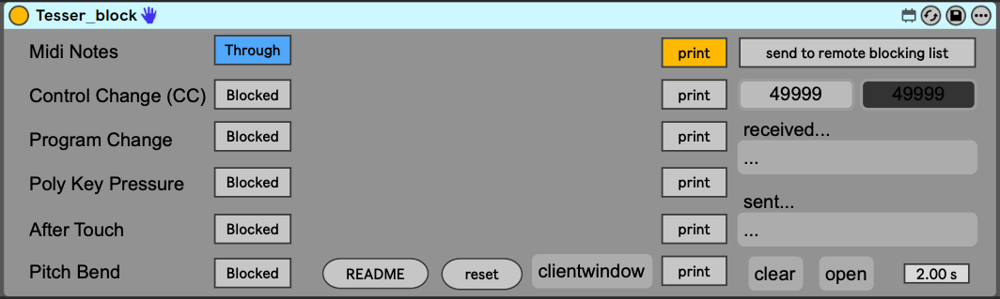

# tesser_block

**tesser_block** is a [Max for Live](https://www.ableton.com/en/live/max-for-live/) device that allows you to **selectively block specific families of incoming MIDI messages**.  It is part of the **TesserAkt** ecosystem of modular Max for Live tools for expressive and interactive performance systems.



---

## 🧩 Overview

`tesser_block` acts as a **MIDI filter**: it lets you enable or disable entire message types such as Control Change, Program Change, Aftertouch, Poly Key Pressure, or Pitch Bend.  
This makes it easy to control how different MIDI sources interact in complex setups — whether you’re performing live, testing mappings, or routing multiple controllers.

You can automate its switches or store presets with your Live Set for quick reconfiguration.

---

## ⚙️ Features

- **Selective MIDI blocking:** Toggle on/off any of the following message types:
  - Control Change (CC)
  - Program Change
  - Polyphonic Key Pressure (Poly Aftertouch)
  - Channel Pressure (Aftertouch)
  - Pitch Bend
- **Lightweight & transparent:** Minimal latency and CPU usage.
- **Automation-ready:** All toggle states can be automated or mapped to Live controls.
- **State recall:** All settings are stored with your Live Set or device preset.

---

## 🎛 Parameters

| Parameter                 | Description                                                   |
| ------------------------- | ------------------------------------------------------------- |
| **Block CC**              | Prevent Control Change messages from passing through          |
| **Block Program Change**  | Prevent Program Change messages                               |
| **Block Poly Aftertouch** | Prevent Polyphonic Key Pressure                               |
| **Block Aftertouch**      | Prevent Channel Pressure                                      |
| **Block Pitchbend**       | Prevent Pitch Bend messages                                   |
| **Monitor** *(optional)*  | Prints incoming blocked messages to Max Console for debugging |

---

## 🔌 Typical Use Case

1. Insert `tesser_block.amxd` into a MIDI track.  
2. Route a MIDI controller or input device into that track.  
3. Enable the blocking of specific message types that you don’t want passed downstream.  
4. Optionally automate these toggles to dynamically alter what messages are filtered during performance.

Example:

> Use `tesser_block` to stop your keyboard’s pitchbend wheel from affecting a soft synth while still allowing notes and CC messages to pass through.

---

## 🧠 Concept

`tesser_block` was designed to simplify MIDI routing management in hybrid performance setups.  By isolating message families, it helps prevent unwanted parameter changes, redundant automation, or feedback loops between devices.

---

## 👥 Credits

This device is a **derivative patch** inspired by and partially based on a design by **AbletonDrummer**.  
Adapted and extended by [Adrián Artacho](https://github.com/AdrianArtacho) as part of the **TesserAkt** Max for Live environment.

---

## 📂 Installation

1. Clone or download this repository:
   
   ```bash
   git clone https://github.com/AdrianArtacho/tesser_block.git
   ```

This Patch is part of the [TESSER environment](https://bitbucket.org/AdrianArtacho/tesserakt/src/master/).


---

# [📝To-Do](https://trello.com/c/kX97LH44/254-tesserblock)
